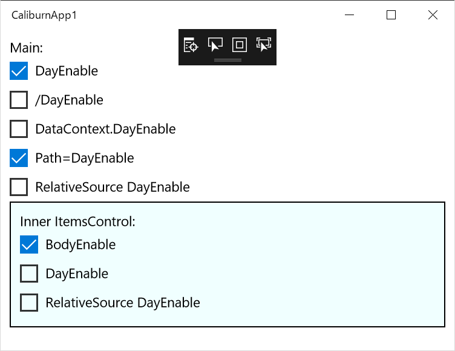

# CaliburnApp1

A MVVM sample app for UWP with Caliburn.Micro

This project for a question for the issue.

https://github.com/Caliburn-Micro/Caliburn.Micro/issues/520

## The problem of Caliburn.Micro this sample reveals

- Properties of ViewModel(especialy, DayEnable) can not be referenced through a DataContext object
- So there is no way to refer to the ViewModel of the page from the descendant of the tag with the ItemsSource attribute
- In particular it is a serious problem that RelativeSource can not be used from the Page's own context

PageView.xaml:

    <StackPanel Background="{ThemeResource ApplicationPageBackgroundThemeBrush}" Margin="10">
        <TextBlock Text="Main:" />
        <CheckBox Content="DayEnable" IsChecked="{Binding DayEnable}" />
        <CheckBox Content="/DayEnable" IsChecked="{Binding /DayEnable}" />
        <CheckBox Content="DataContext.DayEnable" IsChecked="{Binding DataContext.DayEnable}" />
        <CheckBox Content="Path=DayEnable" IsChecked="{Binding Path=DayEnable}"/>
        <CheckBox Content="RelativeSource DayEnable" IsChecked="{Binding DayEnable, RelativeSource={RelativeSource Self}}"/>
        <ItemsControl ItemsSource="{Binding BodiesModel}">
            <ItemsControl.Template>
                <ControlTemplate TargetType="ItemsControl">
                    <Border BorderThickness="1" BorderBrush="Black" Background="Azure">
                        <ItemsPresenter Margin="10" />
                    </Border>
                </ControlTemplate>
            </ItemsControl.Template>
            <ItemsControl.ItemTemplate>
                <DataTemplate>
                    <StackPanel>
                        <TextBlock Text="Inner ItemsControl:" />
                        <CheckBox Content="BodyEnable" IsChecked="{Binding BodyEnable}"/>
                        <CheckBox Content="DayEnable" IsChecked="{Binding DayEnable}"/>
                        <CheckBox Content="RelativeSource DayEnable" IsChecked="{Binding Path=DayEnable, RelativeSource={RelativeSource TemplatedParent}}"/>
                    </StackPanel>
                </DataTemplate>
            </ItemsControl.ItemTemplate>
        </ItemsControl>
    </StackPanel>

PageViewModel.cs:

    public class BodyViewModel
    {
        public bool BodyEnable { get; set; } = true;
    }
    public class PageViewModel : Screen
    {
        public bool DayEnable { get; set; } = true;
        public ObservableCollection<BodyViewModel> BodiesModel { get; set; }

        private readonly INavigationService navigationService;
        public PageViewModel(INavigationService navigationService)
        {
            this.navigationService = navigationService;

            BodiesModel = new ObservableCollection<BodyViewModel>() {
                new BodyViewModel()
            };

            NotifyOfPropertyChange(() => DayEnable);
            NotifyOfPropertyChange(() => BodiesModel);

        }
    }

## Author

KATO Kanryu<k.kanryu@gmail.com>

## License

MIT
